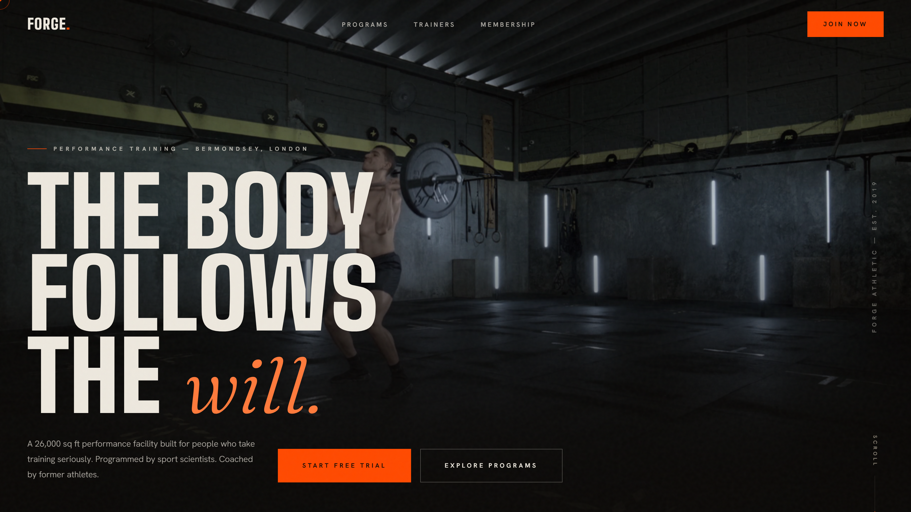
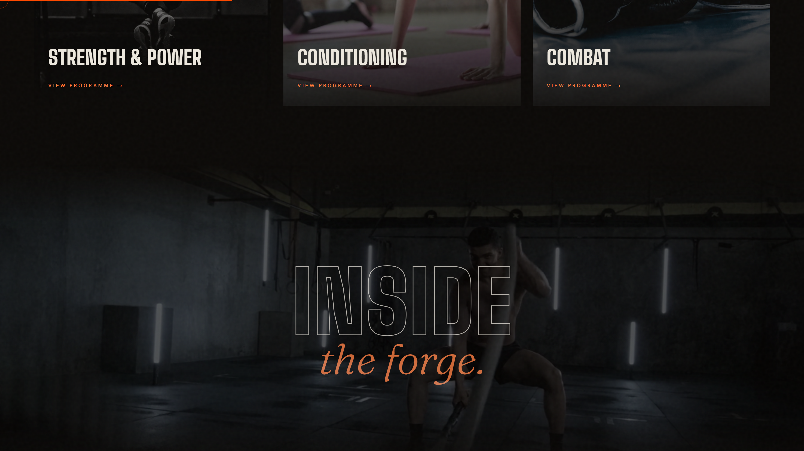
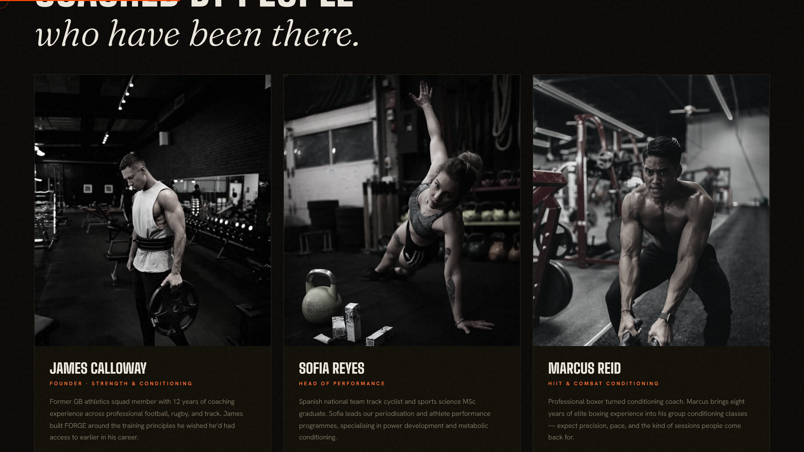
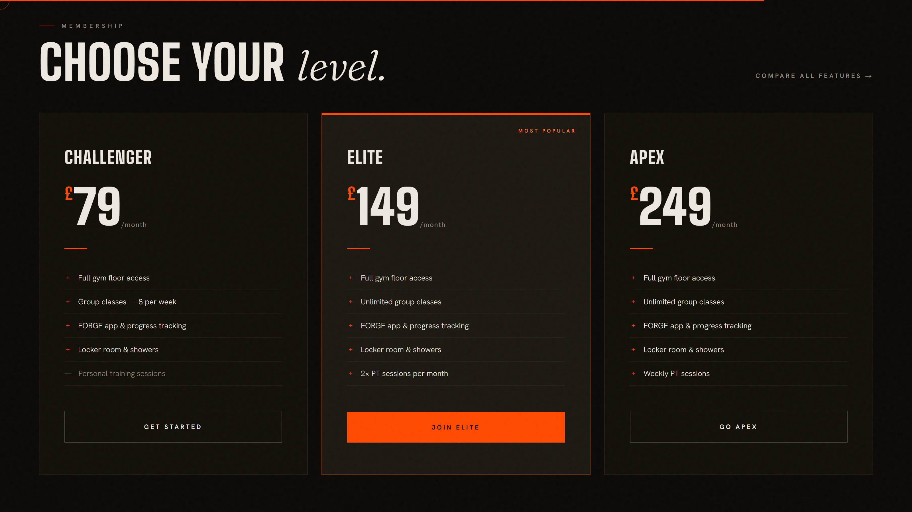
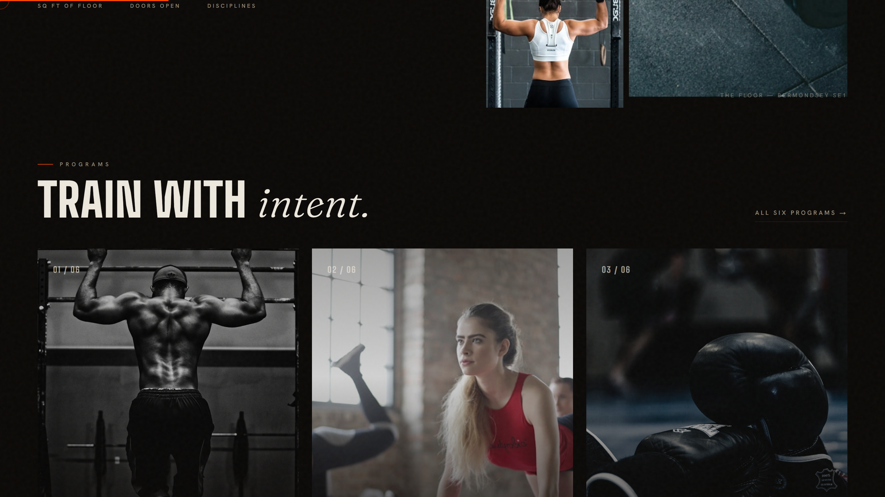

# FORGE Athletic

> **Not a gym. A proving ground.**

A premium marketing site for a fictional London performance-training facility — dark, cinematic, and motion-driven. Built as a portfolio piece to showcase a modern front-end stack end to end: typed content models, server/client component architecture, scroll-driven animation, and self-hosted typography.

**🔗 Live demo → [forge-athletic.netlify.app](https://forge-athletic.netlify.app)**


---

## 📸 Preview



|  |  |
| --- | --- |
|  |  |
|  |  |

---

## ✨ Highlights

- **Full-bleed video hero** with a staged entrance sequence — each headline line rises behind a clip mask
- **Word-level title reveals** — headings are split into animatable word spans at runtime and staggered in with GSAP ScrollTrigger
- **Image "curtain" wipes & parallax** — media unclips bottom-up as it enters the viewport, then drifts subtly on scroll
- **Framer Motion instrumentation** — spring-smoothed scroll progress bar and in-view count-up stat counters
- **Custom cursor, magnetic buttons & spotlight cards** — pointer-aware micro-interactions, gated behind `(hover:hover)` so touch devices never pay for them
- **Film-grain overlay** and an outline-text marquee for analogue texture
- **Fully responsive** — fluid `clamp()` spacing, a three-tier grid system, and a full-screen mobile menu
- **Accessible by default** — `prefers-reduced-motion` support, keyboard focus styles, semantic landmarks

## 🧱 Stack & Architecture

| Layer | Choice | Why |
| --- | --- | --- |
| Framework | **Next.js 16** (App Router) | Static prerendering of all four routes, RSC-first architecture |
| Language | **TypeScript 5** | Typed content model (`lib/data.ts`) drives every page |
| Styling | **Tailwind CSS 4** + a hand-rolled design-token system | Utilities where they help, bespoke CSS where the design demands it |
| Motion | **GSAP 3 + ScrollTrigger** & **Framer Motion 12** | GSAP for scroll choreography, Framer for React-native springs |
| Fonts | **next/font** (Big Shoulders · Hanken Grotesk · Fraunces) | Self-hosted, zero layout shift, no third-party requests |
| Hosting | **Netlify** (Next.js runtime) | CLI-driven deploys |

```
app/
├─ layout.tsx        # fonts, metadata, global chrome
├─ page.tsx          # home — 11 sections
├─ programs/         # 6 training programmes
├─ trainers/         # coaching team
└─ membership/       # tiers, comparison table, join form
components/
├─ Nav / Footer      # global chrome
├─ GsapFx            # scroll choreography (route-aware, self-cleaning)
├─ RevealInit        # IO reveals, video power-saver, magnetic & spotlight FX
├─ ScrollProgress    # Framer Motion scroll spring
├─ Counter           # Framer Motion in-view count-up
└─ Cursor / HeroLoader / JoinForm
lib/
└─ data.ts           # typed content: programmes, trainers, tiers, gallery
```

## 🚀 Getting Started

```bash
npm install
npm run dev      # http://localhost:3000
npm run build    # static production build
```

## 📐 Design Notes

The visual identity leans on three typefaces doing three different jobs: **Big Shoulders** (compressed industrial display) carries the shouting, **Hanken Grotesk** handles body copy, and **Fraunces italic** supplies the editorial counterpoint — lowercase serif moments inside uppercase headlines. A single ember accent (`#FF4A00`) on warm near-black keeps the palette disciplined.

All photography and footage are royalty-free (Unsplash / Mixkit). FORGE Athletic is a fictional brand created for portfolio purposes.

---

Built by **Canberk Yıldız** — [GitHub](https://github.com/canberkyildiz25)
